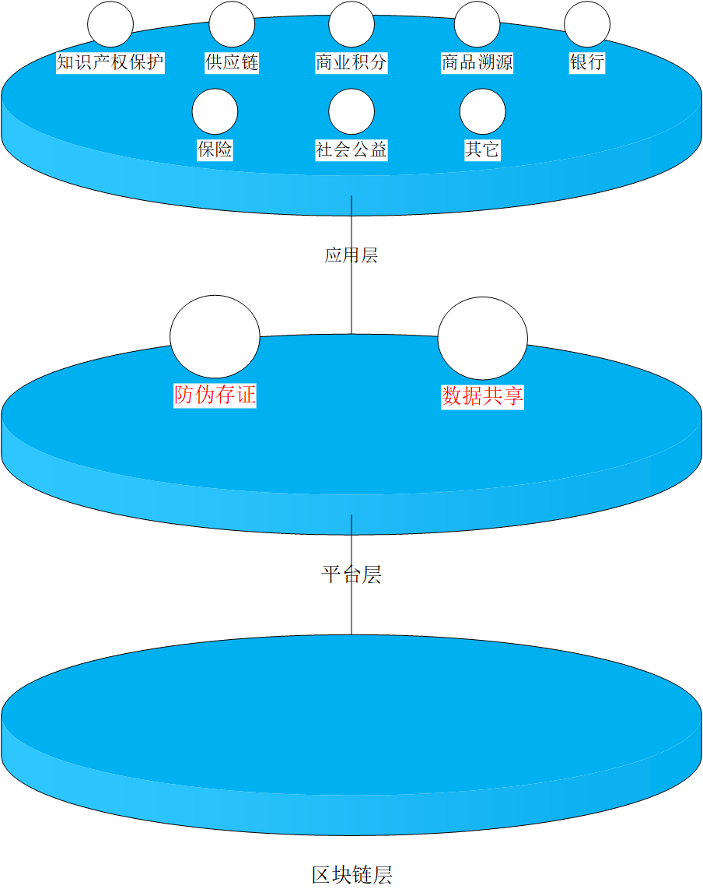

解决方案
===========

一. 业务构架

分层设计，为多个行业或者机构定制解决方案，助你轻松跨入“区块链”时代

二. 区块链应用场景

   1) 版权保护和商品溯源

      a. 传统流程痛点：(i)面临自证难题；(ii)传统鉴证流程繁琐，周期较长。
      
      b. 区块链解决优势：区块链使用多方共识确认，密码学存证，使得数据不可篡改，可溯源，方便可靠。

      以卡戳网文链平台为例：
      
      .. image:: solution/image/2.png