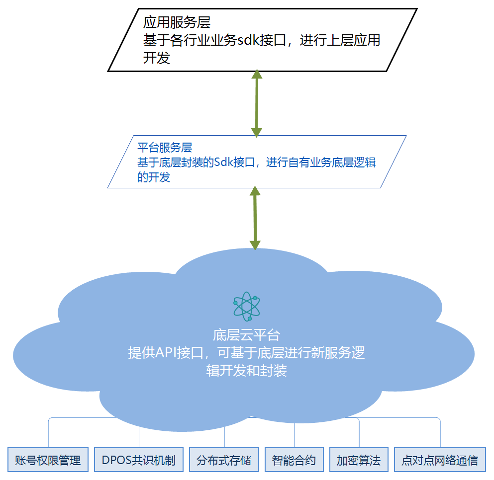

技术框架
==========

一. 技术总体构架

二. 底层技术框架

   1) 用户管理

      a. 账号管理
      
      b. 权限管理

      c. 密钥管理

   2) 基础服务

      a. 接口适配
      
      b. 共识管理

      c. 点对点网络通信

      d. 记录存储

   3) 智能合约

      a. 接口适配
      
      b. 共识管理

      c. 点对点网络通信

      d. 记录存储

   4) 运营监控

      a. 配置、发布
      
      b. 可视化

      c. 监控告警

      d. 云适配，简易接入，强大的兼容能力

三. 平台服务层

   1) 提供主流操作系统的SDK包

   2) 提供SDK使用文档

四. 卡戳网区块链云平台核心技术优势

   1) 高并发 基于eos框架的区块内分片技术，交易和新区块确认合理并发技术，使得百万级的TPS成为可能。

   2) 支持多种数据库接入 支持mongodb、Mysql等数据库。

   3) 应用插件化 支持插件化应用，更多插件支持开发者上传。

   4) DPOS+PBFT的共识算法 使用优化的的DPOS共识和PBFT确认。

   5) 灵活增减节点 可以灵活便捷的进行节点的增加和删除，随时部署，便捷管理。

   6) 便捷部署智能合约 提供可视化编写智能合约和便捷部署合约。

